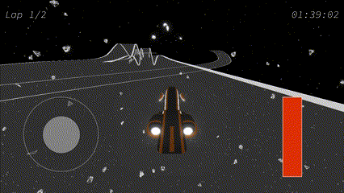

# Racing 🚗

site: https://leslieyip02.github.io/racing/

## Controls
Action            | Button(s)                        
----------------- | -------------------------------- 
Move forward      | <kbd>w</kbd>
Move backward     | <kbd>s</kbd> / <kbd>shift</kbd>
Turn left         | <kbd>a</kbd>
Turn right        | <kbd>d</kbd>
Increase thrust   | <kbd>↑</kbd> / 🖱️ scroll up             
Decrease thrust   | <kbd>↓</kbd> / 🖱️ scroll down
Reverse camera    | <kbd>r</kbd>    

## Speedrun "Tech"
#### *These are features, not bugs*

### Shortcuts
When passing through a checkpoint, the system only checks that it's index is greater than the vehicle's current checkpoint. This allows checkpoints to be skipped by jumping between segments of the track.

### Jumps
A delta time value is passed into the scene everytime its `update()` method is called. This `dt` value keeps increasing even the page is not being loaded or updated. 

Tabbing between pages can cause the vehicle to "jump" because its displacement from its current position is equal to its `velocity` multiplied by `dt`. 

